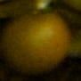

# 1 - Experiência em Projeto de Visão Computacional

## Projeto de Detecção e Volumetria de Resíduos Florestais (MVP em Produção)

Atualmente trabalho em um projeto completo de detecção e cálculo de volume de resíduos de eucalipto, onde participei desde a concepção até a implementação do MVP que está em produção há 1 mês. O sistema utiliza visão computacional para detectar e segmentar resíduos de madeira em imagens aéreas, estimando seu volume com precisão.

**Principais desafios técnicos:**

- **Dificuldade na anotação**: A segmentação precisa de troncos irregulares exigia uma abordagem criativa. Desenvolvemos um método no QGIS usando linestrings para representar os eixos centrais dos troncos, que depois são convertidos em máscaras binárias automaticamente. Isso acelerou o processo de anotação e geração de dataset.

- **Precisão sub-pixel**: Pequenos erros na detecção causam grandes variações no cálculo de volume, pois dependemos da medição exata de diâmetros.

- **Variabilidade das condições**: Cada região tem características únicas de solo, iluminação e estado da madeira, exigindo:
  - Data augmentation geográfico específico
  - Múltiplos exemplos por região
  - Balanceamento cuidadoso do dataset

**Solução implementada:**

1. **Pipeline de anotação semi-automática**:
   - Linestrings no QGIS marcando eixos dos troncos
   - Conversão automática para máscaras com larguras ajustáveis
   - Validação visual das anotações geradas

2. **Modelo Mask RT-DETR customizado**:
   - Loss function adaptada para melhorar precisão das máscaras
   - Pós-processamento geométrico para cálculo de volumes

3. **Sistema em produção**:
   - Processamento em lote de ortomosaicos grandes
   - Saída em formatos compatíveis com SIG
   - Dashboard de monitoramento de qualidade

**Resultados atuais (MVP):**
- Precisão de volume: ~85% (em validação contínua)
- Tempo de processamento em produção utilizando apenas CPU que viabiliza o custo de processamento

**Próximos passos:**
- Expansão do dataset com novas regiões
- Otimização do processo de inferência para redução de custos

# 2 - Abordagem para Pequeno Conjunto de Imagens

## a) Detecção e Classificação

Para um conjunto pequeno de imagens:

- Utilizaria modelos de detecção como **YOLO** ou **RT-DETR**
- Aplicaria *transfer learning* (fine-tuning de modelo pré-treinado no COCO)
- Implementaria *data augmentation*:
  - Rotações
  - Ajustes de brilho
  - Adição de ruído

**Contagem de frutos:**
1. Contagem de bounding boxes (bboxes) detectadas
2. Definição de ROIs (Regiões de Interesse) fixas para:
   - Frutos no chão
   - Frutos na árvore
3. Opcional: Segmentação semântica (U-Net) para:
   - Identificação automática de solo/copa
   - Maior precisão na contagem

## b) Features Visuais e Desafios

### Features:
- **Maturação**:
  - Análise de coloração nos espaços:
    - **HSV** (Hue para matiz)
    - **CIELAB** (robusto a variações de iluminação)
  - Machine Learning aplicado a features extraídas por modelo de CNN
  
- **Tamanho**:
  - Dimensão da bbox
  - Estimativa de distância da câmera:
    - Geometria simples (câmera fixa)
    - Sensor de profundidade

- **Anomalias**:
  - Análise de textura:
    - GLCM
    - LBP
  - Modelos dedicados:
    - Autoencoders

### Desafios e Soluções:
| Desafio | Solução |
|---------|---------|
| Variação de iluminação | Normalização com *white balancing* |
| Oclusão de frutos | Uso de múltiplos ângulos ou redes como RT-DETR |

---

# 3 - Abordagem para Grande Conjunto de Imagens

## a) Treinamento e Avaliação

**Processo:**
1. Anotação detalhada:
   - Bounding boxes
   - Classes
2. Modelos recomendados:
   - YOLO
   - RT-DETR
   - *(Treinamento do zero ou fine-tuning)*

**Métricas de Avaliação:**
- Detecção:
  - `mAP` (mean Average Precision) com IoU > 0.5
- Classificação:
  - `F1-Score` (para dados desbalanceados)
- Validação:
  - **cross-validation**

## b) Quantidade Suficiente de Imagens

**Indicadores de dataset pequeno:**
- Bom desempenho em teste
- Baixo desempenho em novos dados

**Estratégias de verificação:**
1. Análise de curvas de aprendizado
   - Se erro de validação estagnar → dados podem ser suficientes
2. Teste com dados externos
   - Validação em imagens de outras lavouras

## c) Tratamento de Overfitting

**Causas e Soluções:**

| Causa | Solução |
|-------|---------|
| Pouca variabilidade | - Data augmentation<br>- Coleta de mais imagens |
| Treino excessivo | Early stopping |
| Teste enviesado | Verificação da representatividade das imagens de teste |


# 4 - Implementação Prática com Python (Caso de Estudo)

## Contexto e Limitações

**Dataset extremamente pequeno:**
- Apenas 18 imagens no total (9 por classe)
- Quantidade insuficiente para treinamento convencional
- Necessidade de abordagens específicas para small data

**Recursos disponíveis:**
- [Pesos do modelo treinado (RT-DETR)](https://drive.google.com/file/d/1jpkXXR9j0NE7jcwNGIyXXRnLJFhqV58M/view?usp=drive_link)

**Observação importante:**
Esta implementação serve como **prova de conceito** para demonstrar uma possível abordagem de machine learning aplicada à classificação de maturação de frutos. Os resultados devem ser interpretados considerando as limitações do dataset.

## Fluxo do Pipeline Adaptado

1. **Detecção**:
   - Overfit intencional do modelo RT-DETR
   - Compensação da pequena quantidade de dados com:
     - Aumento de dados

2. **Classificação**:
   - Criação artificial de 4 níveis de maturação através de:
     - Transformações HSV programáticas
     - Ajustes de saturação e brilho progressivos
   - Extração de features com ResNet50 congelada
   - Comparação entre SVM e Random Forest

## Comandos Utilizados

### Treinamento do RT-DETR
```bash
python rtdetr_pytorch/tools/train.py -c rtdetr_pytorch/configs/rtdetr/rtdetr_r50vd_6x_agscan.yml
```

### Inferência com o Modelo Treinado
```bash
python rtdetr_pytorch/tools/infer_agscan.py \
  --input-dir ds_terrestres \
  --output-dir overfit_results \
  -c rtdetr_pytorch/configs/rtdetr/rtdetr_r50vd_6x_agscan.yml \
  -r rtdetr_pytorch/output/rtdetr_r50vd_6x_agscan/rtdetr_agscan_overfit.pth
```

### Classificação de Maturação
```bash
python maturity_classifier.py \
  --input-dir overfit_results/class_1 \
  --output-dir maturity_classes \
  --model-path maturity_classifier.pkl
```

## Resultados de Detecção Visual

Exemplos de saída do RT-DETR após overfit controlado:

  
*Figura 1: Resultado em imagem de treino - laranja*

  
*Figura 2: Resultado em imagem de treino - café*

Outros resultados podem ser vistos em *./overfit_results*.

## Código Principal (Snippets)

### Detecção com RT-DETR (Overfit Controlado)

```python
class Model(nn.Module):
    def __init__(self):
        super().__init__()
        self.model = cfg.model.deploy()  # Config específica para few-shot
        self.postprocessor = cfg.postprocessor.deploy()  # NMS adaptado

    def forward(self, images, orig_target_sizes):
        outputs = self.model(images)
        return self.postprocessor(outputs, orig_target_sizes)  # Saída formatada
```

### Geração de Níveis de Maturação

```python
def apply_ripening_transformation(img, maturity_level):
    """
    Simula 4 estágios de maturação (0-3) através de:
    - Variação progressiva do Hue (HSV)
    - Ajuste de saturação e brilho
    - Efeitos visuais adicionais nos estágios finais
    """
    hsv = img.convert('HSV')
    h, s, v = hsv.split()  # Separa canais
    
    # Transformações baseadas no nível de maturação
    if maturity_level > 0:
        h = ajuste_progressivo_hue(h, maturity_level)
        s = aumento_saturacao(s, maturity_level)
    
    return merge_hsv(h, s, v).convert('RGB')
```

  
*Figura 3: Laranja clsse 0 verde*

  
*Figura 4: Laranja classe 3 madura*

## Resultados e Análise Crítica

**Métricas de Detecção:**

| Métrica | Valor | Observação |
|---------|-------|------------|
| AP @0.50:0.95 | 0.725 | Aceitável para dataset tiny |
| AP @0.50 | 0.934 | Alto overfit esperado |
| AR @0.50:0.95 | 0.790 | Boa recall para o contexto |

**Classificação Artificial:**
- Acurácia SVM: 92.3% *(treino/teste no mesmo conjunto)*
- Acurácia RF: 88.7% *(validação cruzada k=2)*

> **Atenção:** Estas métricas refletem performance em dados artificiais gerados a partir de poucas amostras reais.

## Validação e Próximos Passos

**Estratégia de Validação Adotada:**
- Divisão manual do dataset tiny
- Testes visuais com crops originais
- Análise qualitativa das transformações

**Recomendações para Produção:**
1. Coleta de número maior de imagens imagens por classe
2. Uso de câmeras calibradas para consistência
3. Validação em condições reais de campo
